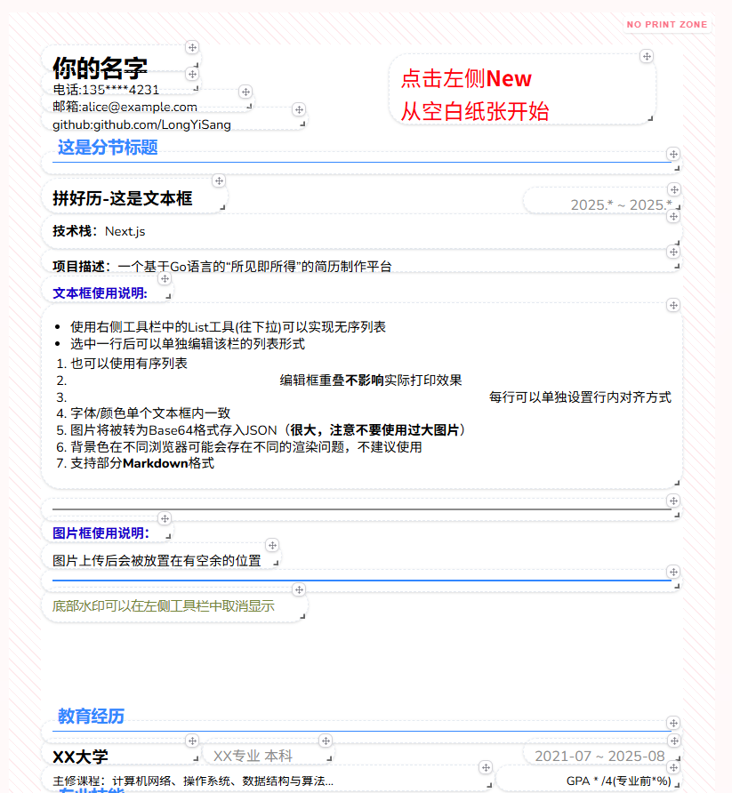
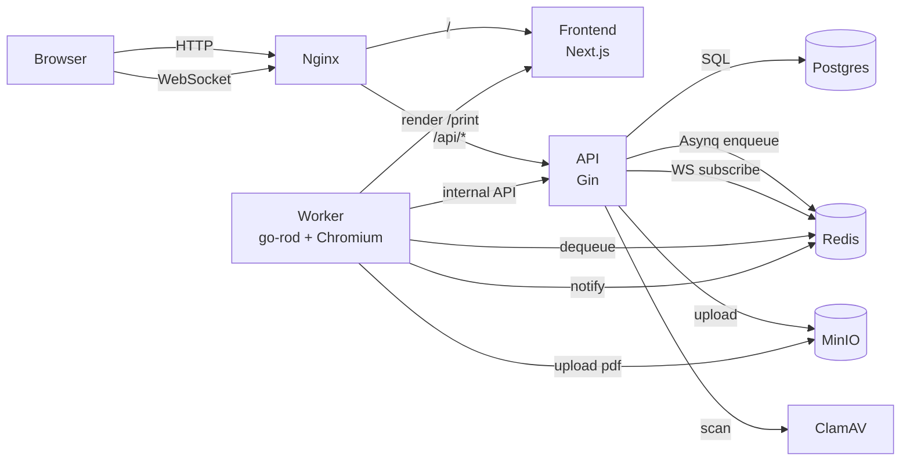

# 拼好历 (phResume)

> 所见即所得的简历编辑器 + 异步 PDF 生成系统

[](https://go.dev)
[](https://nextjs.org)
[](https://gin-gonic.com)
[](https://docs.docker.com/compose/)
[](LICENSE)



## 核心特性

- **24 列网格画布** — 拖拽排版，所见即所得的简历编辑体验
- **异步 PDF 生成** — 基于 Asynq 任务队列 + go-rod（Chromium）渲染打印页，生成结果与编辑器完全一致
- **实时通知** — PDF 生成完成后，通过 Redis Pub/Sub → WebSocket 推送给前端
- **资产安全** — 上传图片先经 ClamAV 病毒扫描，再写入 MinIO 私有桶，访问走预签名 URL
- **一次性下载 Token** — PDF 下载使用短 TTL 一次性 token，避免暴露 Authorization 头
- **模板系统** — 支持保存与复用简历模板，自动生成预览截图
- **限流与防护** — 登录限流/锁定、PDF 生成频控、上传频控（Redis 实现）
- **可观测性内建** — Prometheus + Loki + Grafana 开箱即用

## 技术栈

| 层 | 技术 |
|---|------|
| 前端 | Next.js 16 · React 19 · Tailwind CSS 4 · react-grid-layout · Lexical 富文本 · Framer Motion |
| 后端 API | Go · Gin · GORM · JWT RS256（access + refresh） |
| 异步 Worker | Asynq（Redis 队列）· go-rod（Chromium 无头浏览器） |
| 存储 | PostgreSQL 15 · Redis 8 · MinIO（S3 兼容） |
| 安全 | ClamAV 病毒扫描 · bcrypt 密码哈希 · 预签名 URL · MIME/体积白名单 |
| 可观测性 | Prometheus · Loki · Promtail · Grafana |
| 部署 | Docker Compose · Nginx 反向代理 · GitHub Actions CI/CD |

## 系统架构



### PDF 生成流程

```
用户保存简历 → API 入队 → Worker 拉取任务
    → 请求内部打印数据接口（图片内联为 data URI）
    → go-rod 打开前端 /print 页面渲染
    → 导出 PDF 上传 MinIO
    → Redis Pub/Sub 通知 → WebSocket 推送前端
    → 用户通过一次性 Token 下载 PDF
```

## 快速上手

### 前置要求

- [Git](https://git-scm.com/)
- [Docker](https://www.docker.com/) + Docker Compose v2

### 安装与运行

```bash
# 克隆仓库
git clone https://github.com/LongYiSang/phResume.git
cd phResume

# 复制环境变量模板
cp .env.example .env
```

编辑 `.env`，替换以下必填项：

| 变量 | 说明 |
|------|------|
| `DB_PASSWORD` | PostgreSQL 密码 |
| `MINIO_ROOT_PASSWORD` | MinIO 管理员密码 |
| `GRAFANA_PASSWORD` | Grafana 管理员密码 |
| `INTERNAL_API_SECRET` | Worker 内部接口密钥 |
| `JWT_PRIVATE_KEY` | RSA 私钥（Base64 编码 PEM） |
| `JWT_PUBLIC_KEY` | RSA 公钥（Base64 编码 PEM） |

<details>
<summary>生成 JWT 密钥对</summary>

```bash
# 生成 RSA 2048 密钥对
openssl genrsa -out jwt_private.pem 2048
openssl rsa -in jwt_private.pem -pubout -out jwt_public.pem

# Base64 编码（写入 .env）
openssl base64 -A -in jwt_private.pem   # → JWT_PRIVATE_KEY
openssl base64 -A -in jwt_public.pem    # → JWT_PUBLIC_KEY
```

</details>

```bash
# 一键启动
docker compose up --build
```

首次启动会拉取镜像并初始化所有服务。完成后访问：

| 服务 | 地址 |
|------|------|
| 应用 | http://localhost |
| MinIO 控制台 | http://localhost:9001 |
| Grafana | http://localhost:3000 |

## 项目结构

```
phResume/
├── backend/
│   ├── cmd/
│   │   ├── api/          # Gin API 入口
│   │   ├── worker/       # Asynq Worker 入口
│   │   └── admin/        # 管理员 CLI 工具
│   └── internal/
│       ├── api/          # HTTP/WebSocket handler、middleware
│       ├── auth/         # bcrypt + JWT RS256
│       ├── config/       # 环境变量加载与校验
│       ├── database/     # GORM 模型与初始化
│       ├── metrics/      # Prometheus 指标
│       ├── storage/      # MinIO/S3 客户端封装
│       ├── tasks/        # Asynq 任务定义
│       └── worker/       # go-rod 渲染 + PDF 导出
├── frontend/
│   ├── app/              # Next.js App Router 页面
│   ├── components/       # UI 组件（编辑器、打印视图等）
│   ├── hooks/            # WebSocket、PDF 下载等 hooks
│   └── lib/              # API 路由构造
├── deploy/
│   ├── nginx/            # Nginx 反向代理配置
│   ├── grafana/          # Grafana 数据源与仪表盘
│   ├── prometheus/       # Prometheus 配置
│   ├── loki/             # Loki 配置
│   └── promtail/         # Promtail 配置
├── docs/
│   ├── architecture.md   # 架构设计文档
│   ├── api.md            # API 接口文档
│   └── configuration.md  # 配置说明文档
├── docker-compose.yml    # 本地开发环境
└── docker-compose.prod.yml  # 生产环境
```

## 相关项目

- **[PinResume](https://github.com/LongYiSang/PinResume)** — 纯前端功能 Demo
- **在线体验**: [longyisang.icu](https://longyisang.icu)

## 文档

- [架构设计](docs/architecture.md)
- [API 文档](docs/api.md)
- [配置说明](docs/configuration.md)
- [部署指南](deploy/README-server.md)

## 许可证

本项目基于 [MIT License](LICENSE) 开源。
