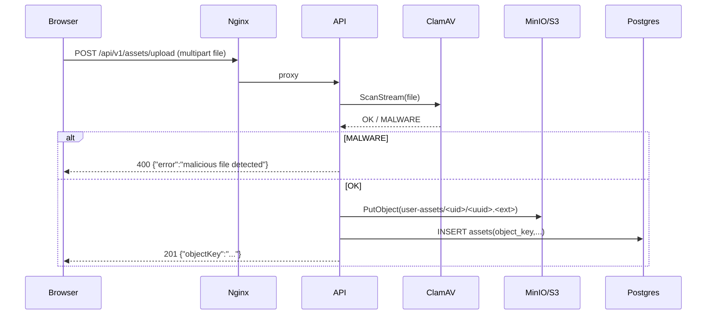

<!--
架构设计文档：
- 解释 phResume 的模块划分、关键数据流向、设计取舍与边界安全。
-->

# 架构设计（phResume）

## 1. 系统目标与边界

phResume 是一个“所见即所得简历编辑 + 异步 PDF 生成”的系统，核心目标：
- 编辑体验：前端提供 24 列网格画布的拖拽排版与实时预览
- 导出稳定：PDF 生成采用异步队列 + 独立 Worker 渲染，避免阻塞 API
- 资产安全：上传图片先做病毒扫描，再写入私有桶，访问通过预签名 URL
- 实时反馈：PDF 生成完成后通过 Redis Pub/Sub → WebSocket 通知前端

系统边界：
- 对外入口统一由 Nginx 暴露 `80/443`（生产建议 443）
- API/Worker/Frontend 之间走内网（docker network）
- 内部打印数据接口仅供 Worker 使用（共享密钥 `INTERNAL_API_SECRET`）

## 2. 模块划分

### 2.1 组件图（部署视角）

```mermaid
flowchart LR
  U[Browser] -->|HTTP| N[Nginx]
  U -->|WebSocket| N

  N -->|/ ->| F[Frontend\nNext.js App Router]
  N -->|/api/* ->| A[API\nGin HTTP]

  A -->|SQL| PG[(Postgres)]
  A -->|Asynq enqueue| R[(Redis)]
  A -->|upload/list/get| S3[(MinIO/S3\nPrivate Bucket)]
  A -->|scan stream| C[ClamAV]
  A -->|WS subscribe| R

  W[Worker\nAsynq Server + Chromium(go-rod)] -->|dequeue| R
  W -->|internal print data\nX-Internal-Secret| A
  W -->|render /print/*| F
  W -->|upload pdf/preview| S3
  W -->|update resume/template| PG
  W -->|publish notify| R

  subgraph Observability[Observability (optional)]
    P[Prometheus] --> A
    P --> W
    G[Grafana] --> P
    L[Loki] <-- PT[Promtail]
  end
```

### 2.2 后端分层（代码视角）

- `backend/cmd/api`：API 进程入口，组装依赖、注册路由、暴露 `/health` `/metrics`
- `backend/cmd/worker`：Worker 入口，启动 Asynq Server，暴露 worker `/metrics`
- `backend/internal/api`：HTTP handler、WebSocket handler、middleware、打印数据构建
- `backend/internal/tasks`：Asynq task type/payload 构造
- `backend/internal/worker`：任务消费（go-rod 渲染、导出 PDF、截图预览、Redis 通知）
- `backend/internal/storage`：MinIO/S3 client 封装（上传、预签名、删除）
- `backend/internal/auth`：bcrypt + JWT RS256（access/refresh）
- `backend/internal/database`：GORM 模型与数据库初始化
- `backend/internal/config`：环境变量配置加载/默认值/校验
- `backend/internal/metrics`：Prometheus 指标（Gin/Asynq）

### 2.3 前端模块

- `frontend/app/page.tsx`：主编辑器（网格布局、撤销/重做、模板面板、资产面板、下载触发与 WS 监听）
- `frontend/components/PrintView.tsx`：打印渲染页组件（用于 Worker 渲染 PDF/预览）
- `frontend/app/print/[id]` 与 `frontend/app/print-template/[id]`：打印页路由
- `frontend/lib/api-routes.ts`：API 路由构造与 WebSocket URL 解析
- `frontend/hooks/useWebSocketConnection.ts`：WS 连接/重连/心跳
- `frontend/hooks/usePdfDownload.ts`：提交生成、接收通知、签发一次性下载 token、下载文件

## 3. 关键数据流

### 3.1 登录与会话（JWT + refresh cookie）

要点：
- access token：放在 `Authorization: Bearer ...`，用于 API 与 WebSocket 鉴权
- refresh token：服务端写入 `HttpOnly` Cookie（`refresh_token`），用于无感刷新
- refresh token 黑名单：Redis key `auth:refresh:blacklist:<jti>`（防止旧 token 被复用）
- 强制改密：`TokenClaims.MustChangePassword=true` 时，业务 API 与 WS 都会拒绝访问

### 3.2 简历 CRUD（Postgres JSONB）

数据模型（简化）：
- `users`：账号、密码哈希、`must_change_password`、`active_resume_id`
- `resumes`：`content`（JSONB）、`pdf_url`（MinIO object key）、`preview_image_url`（预签名 URL）、`preview_object_key`
- `templates`：同样用 JSONB 存储模板内容，并有预览图字段
- `assets`：用户资产对象键（`user-assets/<uid>/...`）与 meta

### 3.3 资产上传（ClamAV + 私有桶 + 预签名）



关键设计点：
- 扫描通过后才上传，降低污染对象存储的概率
- objectKey 强制包含 `user-assets/<uid>/` 前缀，避免越权访问
- 访问图片不直接暴露私有桶：返回短期预签名 URL（`/v1/assets/view` 或 list 中附带）

### 3.4 PDF 生成（异步 + go-rod 渲染打印页）

```mermaid
sequenceDiagram
  participant U as Browser
  participant N as Nginx
  participant A as API
  participant R as Redis/Asynq
  participant W as Worker (Chromium)
  participant F as Frontend (/print)
  participant S as MinIO/S3
  participant PG as Postgres
  participant WS as WebSocket (API)

  U->>N: GET /api/v1/resume/:id/download
  N->>A: proxy
  A->>R: Enqueue pdf:generate {resume_id, correlation_id}
  A-->>U: 202 accepted (correlation_id)

  W->>R: Dequeue pdf:generate
  W->>A: GET /v1/resume/print/:id (X-Internal-Secret)
  A-->>W: PrintData (images inlined; warnings optional)
  W->>F: Open /print/:id (go-rod)
  W->>F: Pre-inject window.__PRINT_DATA__
  F-->>W: #pdf-render-ready ready
  W->>W: PrintToPDF()
  W->>S: Upload generated-resumes/<uid>/<uuid>.pdf
  W->>PG: UPDATE resumes.pdf_url/status
  W->>R: PUBLISH user_notify:<uid> (status=completed/error)
  WS-->>U: WebSocket message forwarded

  U->>N: GET /api/v1/resume/:id/download-link
  N->>A: proxy (Authorization)
  A-->>U: {token, uid, expires_in}
  U->>N: GET /api/v1/resume/:id/download-file?uid&token
  N->>A: proxy
  A->>S: GetObject(pdf_url) + stream
  A-->>U: application/pdf attachment
```

关键设计点：
- 生成过程异步化：API 只负责入队，避免长耗时阻塞
- Worker 使用真实前端打印页渲染（WYSIWYG）：确保“所见即所得”
- 打印数据通过内部接口提供，并将图片内联为 data URI，减少打印页在渲染时对外部资源的依赖与竞态
- 完成通知通过 Redis Pub/Sub → WebSocket，前端无需轮询
- 下载使用一次性 token：避免把 Authorization 暴露给浏览器下载器/新窗口，且可短 TTL + 一次性消费

### 3.5 模板预览图生成（截图）

模板预览任务与 PDF 类似，差异：
- 拉取 `/v1/templates/print/:id` 的打印数据
- 打开前端 `/print-template/:id` 页面
- 截图生成 `thumbnails/template/<template_id>/preview.jpg` 并写回 `templates.preview_image_url/object_key`

## 4. 安全设计

### 4.1 内部接口隔离

- 内部打印数据接口强制校验 header：`X-Internal-Secret`
- 生产 Nginx 默认阻断外网访问：`/api/v1/(resume|templates)/print/*`（返回 404）

### 4.2 上传安全

- ClamAV 扫描（stream）：
  - 扫描失败/命中病毒：拒绝上传
- MIME 白名单 + 体积限制：
  - `API_UPLOAD_MIME_WHITELIST`
  - `API_UPLOAD_MAX_BYTES`
- objectKey 归属校验：
  - 仅允许 `user-assets/<uid>/...` 且后缀为图片类型

### 4.3 限流与滥用防护

- 登录限流与锁定（Redis）：
  - `API_LOGIN_RATE_LIMIT_PER_HOUR`
  - `API_LOGIN_LOCK_THRESHOLD` / `API_LOGIN_LOCK_TTL`
- PDF 生成频控：
  - `API_PDF_RATE_LIMIT_PER_HOUR`
- 上传每日次数控制：
  - `API_MAX_UPLOADS_PER_DAY`
- Nginx 层（生产）也配置了额外限流（按 IP），作为第一道防线

### 4.4 Cookie 与跨域

- refresh token cookie：`HttpOnly` + `SameSite=Lax`，是否 `Secure` 取决于是否 HTTPS（或 `X-Forwarded-Proto=https`）
- WebSocket Origin 校验：`API_ALLOWED_ORIGINS` 为空时只允许同源
- `API_COOKIE_DOMAIN` 可用于跨子域共享 cookie（生产建议配置为顶级域）

## 5. 可观测性（Phase 4）

- API 指标：`GET /metrics`（Gin middleware 采集）
- Worker 指标：独立 HTTP server（默认 `:9100/metrics`）
- Prometheus：通过 docker_sd 自动发现 `api` 与 `worker` 容器并抓取 `/metrics`
- Loki/Promtail：采集容器日志，Grafana 统一展示

## 6. 设计取舍与理由

- 为什么用“前端打印页 + Chromium”导出 PDF：
  - 让导出结果与编辑器渲染一致（WYSIWYG）
  - 避免在后端再实现一套排版/字体/图片处理逻辑
- 为什么引入 Asynq（Redis 队列）：
  - 控制并发、自动重试、任务隔离，提升稳定性
  - API 可快速返回，用户体验更好
- 为什么下载走一次性 token 而不是直接预签名 URL：
  - 避免对外暴露对象 key/桶结构
  - 允许服务端集中做下载安全控制（TTL、一次性消费、文件名清洗、no-store 等）

## 7. 与配置的对应关系

所有环境变量与默认值详见：`docs/configuration.md`。
